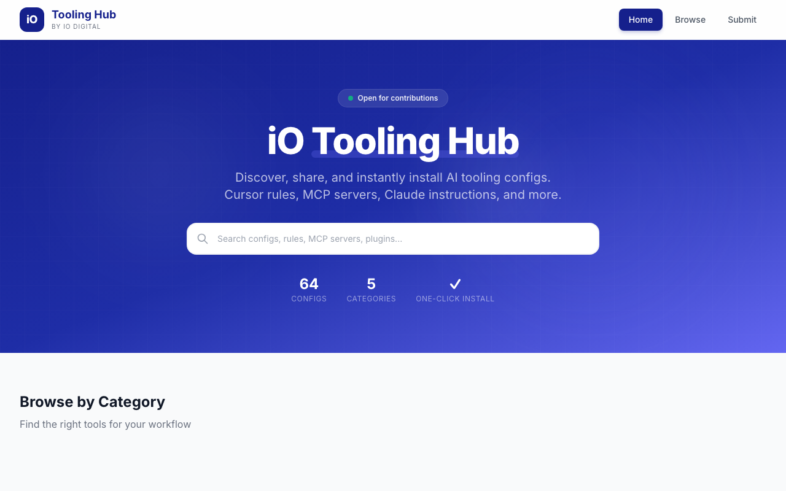

# iO Tooling Hub



A platform for iO Digital colleagues to discover, share, and one-click install AI tooling configurations.

Browse cursor rules, MCP server configs, Claude instruction files, IDE plugins, and reusable AI skill workflows — all in one place.

## Features

- **One-click install** — Add MCP servers to Cursor via deep links, install VS Code extensions, or copy configs to clipboard
- **54 configs** across 5 categories: Cursor Rules, MCP Configs, Claude Files, Plugins, and Skills
- **Submit flow** — Multi-item submission form with passcode gate and PR-based review
- **Search** — Client-side full-text search across all configs
- **Registry API** — Static JSON endpoints for programmatic access by AI tools
- **Animated UI** — Scroll reveals, hover effects, and page transitions with Framer Motion

## Tech Stack

- [Astro](https://astro.build) — Static site generation with content collections
- [React](https://react.dev) — Interactive islands (search, install buttons, forms)
- [Tailwind CSS](https://tailwindcss.com) — Styling with iO brand tokens
- [Framer Motion](https://www.framer.com/motion/) — Animations
- TypeScript throughout

## Project Structure

```
src/
  components/      React islands and Astro components
  content/         Markdown content files (5 collections)
  layouts/         Base layout with header and footer
  lib/             Collection helpers, icon utilities
  pages/           Routes: home, browse, item detail, submit, API
  styles/          Global CSS with iO brand tokens
```

## Getting Started

```sh
npm install
npm run dev
```

Open [localhost:4321](http://localhost:4321) to view the site.

## Commands

| Command           | Action                                      |
| :---------------- | :------------------------------------------ |
| `npm install`     | Install dependencies                        |
| `npm run dev`     | Start dev server at localhost:4321           |
| `npm run build`   | Build production site to `./dist/`           |
| `npm run preview` | Preview the build locally before deploying   |

## API Endpoints

| Endpoint               | Description              |
| :--------------------- | :----------------------- |
| `/api/registry.json`   | List all configs         |
| `/api/search.json`     | Full search index        |
| `/api/install/:slug`   | Raw config for a single item |

## Adding Content

Add a markdown file to the appropriate `src/content/` subdirectory with the required frontmatter schema. Run `npm run build` to verify it passes validation.

## License

Internal iO Digital project.
